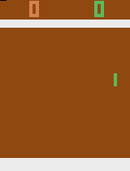

# Atari Gamer

Atari Gamer is a naive AI that can play Atari games. 

It is a course project of *Machine Learning*  @ ACM Class, SJTU.

For more details about this project, please read the report.

## How to run

If you know nothing about it, just run

```shell
$ python --help
```

For a quick start, assuming you have 5 GiB GPU memory and you want to let it learn to play *Pong* from scratch, please run

```shell
$ python main.py --env PongNoFrameskip-v4 --mem 5 --train
```

However, if the training was suspended for some reasons and you want to continue, run

```shell
$ python main.py --env PongNoFrameskip-v4 --mem 5 --cont_train FILE_PATH
```

The `FILE_PATH` should be replaced by the file path of your agent.

If you are eager to see your agent playing *Pong*, run

```shell
$ python main.py --env PongNoFrameskip-v4 --play FILE_PATH
```

## Gallery

